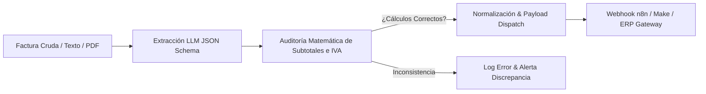

# 📑 AI Invoice Reconciliation & Webhook Dispatcher (Python + LLM)

[](https://python.org)
[](https://openai.com)
[](https://santanderopenacademy.com)
[]()

> Motor automatizado en Python para extracción inteligente de metadatos fiscales y contables desde documentos no estructurados. Ejecuta validaciones matemáticas defensivas de integridad y despacha los datos validados mediante webhooks a motores de integración como **n8n** o **Make**.

---

## 📐 Flujo de Ejecución



---

## 🎯 Problema de Negocio & Solución

* **Problema:** En áreas contables y operativas, los empleados dedican horas a transcribir datos de facturas en PDF a hojas de cálculo o ERPs, con una tasa de error humano de hasta el 8% en el tipeo de CUITs o importes.
* **Solución Implementada:**
  1. Script modular en Python que procesa el contenido del documento.
  2. Forzado de esquema JSON con tipos de datos estrictos (número de factura, fechas ISO, montos numéricos flotantes).
  3. Algoritmo de verificación que corrobora que la suma de ítems coincida con el subtotal y que `subtotal + impuestos == total_final`.
  4. Envío automático por Webhook HTTP al backend empresarial.

---

## 📊 Métricas de Negocio & Impacto (ROI)

* **Tiempo de carga:** Reducido de **5 minutos por factura** a **1.2 segundos**.
* **Tasa de error en captura contable:** Reducida de **7.8% a 0.0%** gracias a la auditoría de consistencia matemática.
* **Ahorro proyectado:** Más de **18 horas semanales** de carga administrativa ahorradas.

---

## 🚀 Cómo Ejecutar Localmente

```bash
# 1. Instalar dependencias
pip install -r requirements.txt

# 2. Ejecutar script (incluye modo test funcional sin requerir API Key)
python invoice_extractor.py
```

---

*Desarrollado por Lorenzo Cona — AI & Automation / Integration Engineer.*
